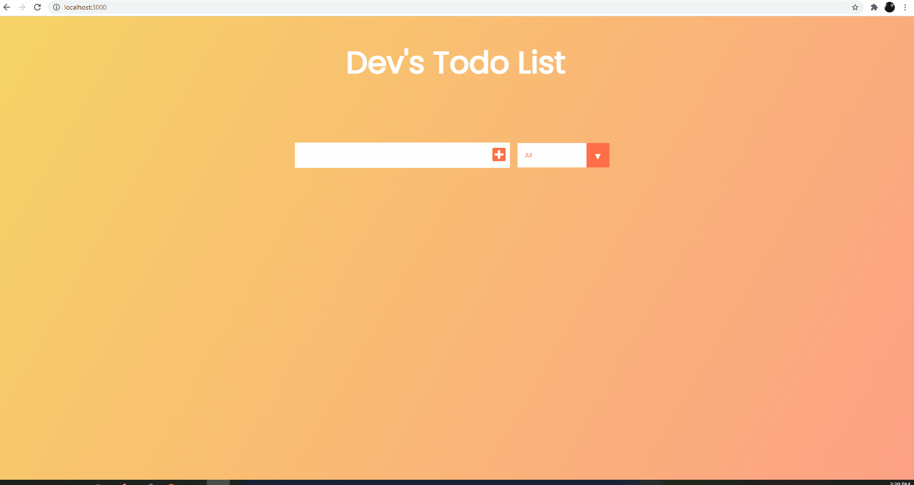

<h1 style="text-align: center;">Dev Todo List</h1>

This project has been developed during <a href="https://www.youtube.com/watch?v=pCA4qpQDZD8&list=RDCMUClb90NQQcskPUGDIXsQEz5Q&start_radio=1&t=5632">Ed's React Tutorial</a> tutorial

Dev Todo List is a simple project to organize daily tasks, and save this tasks into localStorage!

In this app we use only ReactJs

How to use? After run command <code>git clone</code> run in your clone <code>npm i</code>, finaly run de comand <code>npm start</code>! This app will build at port 3000! You need to have node installed on your computer

